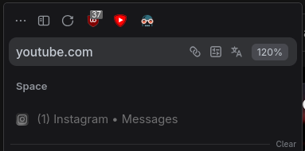
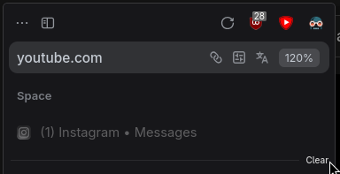

# Back Fwd Hidden (ext)

A [Zen Browser](https://zen-browser.app) mod that always hides the **back** and
**forward** buttons — handy if your mouse already has back/forward side buttons — **while
keeping your extension buttons right-aligned**.

| Original mod | This mod |
|:---:|:---:|
|  |  |

## Why this exists

The original *"Back Fwd Always Hidden"* mod also hides
`#zen-sidebar-top-buttons-separator`. That separator is the **flexible spring** inside the
toolbar's flexbox row (`#zen-sidebar-top-buttons-customization-target`) that pushes the
extension buttons to the right edge. Hiding it makes the extensions collapse to the left.

This mod hides **only** the back/forward buttons and keeps the spring (and forces it to
grow), so your extension buttons stay flush right.

The buttons reappear while you're customizing the toolbar, so you can still rearrange
things.

## Options

In Settings → Mods → Back Fwd Hidden ext you'll find one toggle:

| Option | Default | Effect |
|:---|:---:|:---|
| Also hide the reload button | off | Hides `#reload-button` using the same "not while customizing" rule |

## Install

**From the Zen Mods store:** search for **Back Fwd Hidden ext** in Settings → Mods.

**Manual import:** in Zen, go to Settings → Mods → **Import** and select
[`bfah-mod.json`](bfah-mod.json) (the CSS is embedded, so it's fully self-contained).

**Manual file install:** copy [`chrome.css`](chrome.css) into
`<profile>/chrome/zen-themes/<some-uuid>/chrome.css` and add a matching entry to
`<profile>/zen-themes.json` — but do it with **Zen fully closed**, otherwise Zen
overwrites the registry on exit.

## The CSS

```css
:root:not([customizing]) #back-button,
:root:not([customizing]) #forward-button {
  display: none !important;
}

:root:not([customizing]) #zen-sidebar-top-buttons-separator {
  flex: 1 1 auto !important;
}

@media (-moz-bool-pref: "mod.bfah.hide_reload_button") {
  :root:not([customizing]) #reload-button {
    display: none !important;
  }
}
```

## License

MIT — see [LICENSE](LICENSE).
